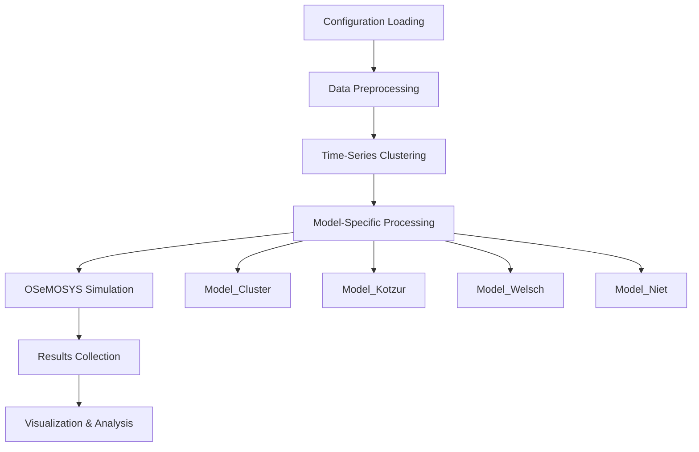

# Workflow Guide

This guide explains the complete workflow implemented in `main.py` for running Storage-in-OSeMOSYS analysis.

## Overview

The Storage-in-OSeMOSYS workflow processes energy system data through four different temporal representation methods, comparing their approaches to modeling energy storage systems. The workflow is designed to be:

- **Automated**: Single command execution with configuration-driven parameters
- **Modular**: Each temporal method is processed independently  
- **Comparative**: Results from all methods are analyzed together
- **Reproducible**: Consistent environment and dependency management

## Workflow Architecture



## Detailed Workflow Steps

### 1. Configuration and Initialization

```python
# Load configuration
config_path = Path('config/config.yaml')
config = utils.load_config(config_path)

# Extract key parameters
scenario_name = config['scenario_name']           # e.g., "k4h1WND"
days_in_year = config['days_in_year']            # e.g., 365
n_clusters = config['n_clusters']                # e.g., 4
hour_grouping = config['hour_grouping']          # e.g., 1 (hourly)
```

**Key Configuration Parameters:**
- `scenario_name`: Identifier for the analysis run
- `days_in_year`: Total days to model (typically 365)
- `n_clusters`: Number of representative days for clustering
- `hour_grouping`: Time aggregation (1=hourly, 24=daily)
- `seasons`: Number of seasons for temporal modeling
- Storage parameters: `StorageLevelStart`, `StorageMaxCapacity`, `ResidualStorageCapacity`

### 2. Data Preprocessing and Clustering

```python
# Load input time-series data
input_CF_csv_file = Path(config['data_8760']['directory']) / config['data_8760']['CF']
input_SDP_csv_file = Path(config['data_8760']['directory']) / config['data_8760']['SDP']

# Perform time-series clustering
representative_days, chronological_sequence = src.cluster_data(
    input_CF_csv_file, input_SDP_csv_file, n_clusters
)
```

**Data Processing:**
- **Capacity Factor (CF)**: Hourly renewable energy generation profiles (8760 hours)
- **Specified Demand Profile (SDP)**: Hourly electricity demand data (8760 hours)
- **K-means clustering**: Groups similar days into `n_clusters` representative days
- **Outputs**: Representative day indices and chronological sequence mapping

**Temporal Calculations:**
```python
blocks_per_day = 24 // hour_grouping        # Time blocks per day
timeslices = len(representative_days) * blocks_per_day  # Total timeslices in model
chronological_timeslices = days_in_year * blocks_per_day  # Full year timeslices
```

### 3. Model-Specific Processing

Each temporal representation method requires specific data transformations:

#### Model_Cluster (Time-Series Clustering)
```python
if case_name == 'Model_Cluster':
    # Update chronological timeslice mapping
    src.new_list(chronological_timeslices, output_timeslicecro_csv_file)
    
    # Create conversion between timeslices and chronological sequence
    src.conversionlts(blocks_per_day, chronological_timeslices, timeslices, 
                     chronological_sequence, representative_days, output_conversionlts_csv_file)
    
    # Update time splitting parameters
    src.new_yaml_param(otoole_yaml_file, 'DaySplit', day_split)
```

#### Model_Kotzur (Daily Mapping Method)
```python
if case_name == 'Model_Kotzur':
    # Create chronological day sequence
    src.new_list(days_in_year, output_dayscro_csv_file)
    
    # Map representative days to timeslices
    src.conversionld(timeslices, len(representative_days), output_conversionld_csv_file)
    
    # Create day-to-cluster mapping
    src.conversionldc(chronological_sequence, representative_days, days_in_year, 
                     output_conversionldc_csv_file)
```

#### Model_Welsch (Fixed Pattern Method)
```python
if case_name == 'Model_Welsch':
    # Define daily time brackets
    src.new_list(blocks_per_day, output_dailytimebracket_csv_file)
    
    # Create multiple conversion mappings
    src.conversionld(timeslices, len(representative_days), output_conversionld_csv_file)
    src.conversionlh(timeslices, blocks_per_day, output_conversionlh_csv_file)
    src.conversionld(timeslices, seasons, output_conversionls_csv_file, label='SEASON')
    
    # Update day type mapping
    src.daysindaytype(representative_days, chronological_sequence, output_daysindaytype_csv_file)
```

#### Model_Niet (Direct Chronological Method)
```python
# Common processing for all models including Model_Niet
if case_name in ['Model_Niet', 'Model_Cluster', 'Model_Kotzur', 'Model_Welsch']:
    # Copy base input files
    for csv_file in csv_files:
        if csv_file.stem in expected_file_names:
            shutil.copy(csv_file, input_csv_dir / csv_file.name)
    
    # Update core timeslice structure
    src.new_list(timeslices, output_timeslice_csv_file)
    src.new_list(len(representative_days), output_daytype_csv_file)
    
    # Create year split mapping
    src.yearsplit(timeslices, representative_days, chronological_sequence, 
                 days_in_year, output_yearsplit_csv_file)
    
    # Process renewable profiles (averaging for capacity factors)
    src.CFandSDP(input_CF_csv_file, representative_days, hour_grouping, 
                output_CF_csv_file, operation='mean')
    
    # Process demand profiles (summing for demand)
    src.CFandSDP(input_SDP_csv_file, representative_days, hour_grouping, 
                output_SDP_csv_file, operation='sum')
```

### 4. OSeMOSYS Model Conversion and Simulation

```python
# Convert CSV files to OSeMOSYS datafile format
result = otoole.convert(template_config, 'csv', 'datafile', input_csv_dir, output_txt_file)

if result:
    utils.print_update(level=2, message="✔️ Otoole conversion executed successfully.")
else:
    utils.print_update(level=2, message="❌ Otoole conversion failed.")

# Run OSeMOSYS simulation
src.run_simulation(case_info)
```

**Simulation Process:**
1. **Data Conversion**: CSV files → OSeMOSYS datafile format using OtoOle
2. **Model Execution**: GLPK solver runs OSeMOSYS optimization
3. **Result Generation**: Solver outputs solution files with optimal values

### 5. Results Collection and Processing

```python
# Save simulation results
results_case = Path(case_info['root_directory']) / case_info['results']['directory'] / case_info['results']['storage_level']
new_results_filename = '_'.join([scenario_name, results_copied_filename, case_name]) + '.csv'
src.copy_and_rename(results_case, results_destination_folder, new_results_filename)

# Generate summary tables
src.table(simulation_results, data_sol_results, scenario_name, case_name, 
         capacity_path, storage_capacity_path, 'WINDPOWER', 'BATTERY', results_file)
```

**Results Structure:**
- **Storage levels**: Time-series of battery state of charge
- **Capacity results**: Optimal technology and storage capacities
- **Summary tables**: Excel files with key performance indicators
- **Standardized naming**: `{scenario_name}_{results_copied_filename}_{case_name}.csv`

### 6. Post-Processing and Visualization

```python
# Generate intraday profiles for comparison methods
src.intraday_kotzur(file_conversionlts, file_kotzur_storage, 
                   StorageLevelStartKotzur, file_kotzur_intraday)

src.intraday_welsch2(file_welsch_storage, blocks_per_day, timeslices, 
                    representative_days, chronological_sequence, 
                    StorageLevelStartWelsch, file_welsch_intraday)

# Create comparative visualizations
fig, fig2, fig3 = src.graph(file_base, file_kotzur, file_kotzur_intraday, 
                           file_cluster, file_niet, file_welsch, file_welsch_intraday, 
                           representative_days, blocks_per_day, output_yearsplit_csv_file)

# Save figures
fig.savefig(Path(results_destination_folder) / f"{scenario_name}_Figure.png")
fig2.savefig(Path(results_destination_folder) / f"{scenario_name}_Figure_Hourly.png")  
fig3.savefig(Path(results_destination_folder) / f"{scenario_name}_Figure_Hourly_2Weeks.png")
```

## Execution Commands

### Basic Execution
```bash
# Run complete workflow
python main.py
```

### Environment Management
```bash
# Setup environment
make setup

# Test environment
make test-env

# Clean environment
make clean

# Update dependencies
make update-env
```

### Configuration Options

Edit `config/config.yaml` before running:

```yaml
# Analysis parameters
scenario_name: "k4h1WND"      # Scenario identifier
days_in_year: 365             # Total days to model
n_clusters: 4                 # Representative days
hour_grouping: 1              # Time resolution (1=hourly)
seasons: 4                    # Seasonal divisions

# Storage parameters
StorageLevelStart: 0.5        # Initial state of charge
StorageMaxCapacity: 100       # Maximum storage capacity
ResidualStorageCapacity: 0    # Pre-existing storage

# Data paths
data_8760:
  directory: "Data_8760"
  CF: "CapacityFactor.csv"    # Renewable profiles
  SDP: "SpecifiedDemandProfile.csv"  # Demand profiles

# Results configuration
results:
  directory: "Results"
  directory_GUI: "Results_GUI"
  results_copied_filename: "Storage_Level"
  results_excel_file: "results.xlsx"
```

## Output Structure

After execution, the workflow generates:

```
Results/
├── k4h1WND_Storage_Level_Model_Cluster.csv
├── k4h1WND_Storage_Level_Model_Kotzur.csv  
├── k4h1WND_Storage_Level_Model_Welsch.csv
├── k4h1WND_Storage_Level_Model_Niet.csv
├── k4h1WND_Storage_Level_Model_Kotzur_intraday.csv
├── k4h1WND_Storage_Level_Model_Welsch_intraday.csv
├── k4h1WND_Figure.png                    # Overview comparison
├── k4h1WND_Figure_Hourly.png            # Detailed hourly view  
├── k4h1WND_Figure_Hourly_2Weeks.png     # Two-week detail
└── results.xlsx                          # Summary tables
```

## Performance Considerations

- **Computational Time**: Model_Niet (highest) > Model_Welsch > Model_Kotzur > Model_Cluster (lowest)
- **Memory Usage**: Proportional to `n_clusters` and `hour_grouping` resolution
- **Disk Space**: Results scale with number of technologies and time resolution
- **Parallel Processing**: Models run sequentially; can be parallelized for independent analysis

## Troubleshooting

### Common Issues

1. **OtoOle Conversion Failure**
   ```bash
   # Check file formats and paths
   ls inputs_csv/
   # Verify configuration matches file names
   ```

2. **GLPK Solver Issues**
   ```bash
   # Test solver installation
   glpsol --version
   # Check model file syntax
   ```

3. **Memory Issues**
   ```bash
   # Reduce time resolution or clusters
   hour_grouping: 2  # 12-hour blocks instead of hourly
   n_clusters: 3     # Fewer representative days
   ```

4. **Missing Results**
   ```bash
   # Check simulation status in model directories
   ls Model_*/Results/
   # Verify solver completed successfully
   ```

This workflow provides a comprehensive framework for comparing temporal representation methods in energy storage modeling, enabling researchers to understand trade-offs between computational efficiency and model accuracy.
